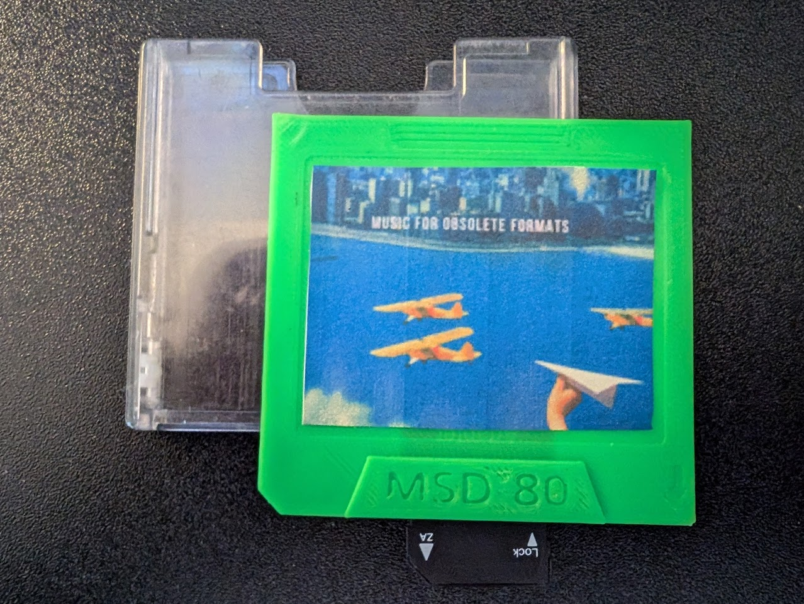

# OMD: The Open Music Distribution Format

!
## Description

Traditional physical audio formats like vinyl, cassettes, and CDs offer a tactile and curated listening experience that many music enthusiasts value. These formats, with their tangible artwork and limited storage capacity, create a focused connection to the music that modern streaming services lack. Streaming, while convenient, often devalues music by eliminating physical elements such as liner notes and overwhelming listeners with an infinite array of options, diluting the sense of ownership and engagement.

For artists, physical media remains a vital source of revenue. However, at lower production volumes, traditional formats can be prohibitively expensive to produce, limiting their accessibility and profitability.

In recent years, there has been a gradual resurgence of interest in physical media among music consumers. Yet, retro formats come with their own challenges, including high production costs, limited portability, and compromises in sound quality.

To address these issues, we propose a new portable, high-fidelity physical music format. The 'format' is essentially a housing compatiable with a standard SD card which can be 3D printed. The aim is to give artists the opportunity to create a physical, sellable copy of their work in a portable physical format that they can produce at low volumes, low cost and high fidelity.  Fans get a high quality copy of the music in a collectable format that can include album art, liner notes etc that they can play using existing hardware or via cheap and widely available adapters.

## Hardware

### Cartridge
There will be a reference design in slvs Fusion format for the cartridge that can be used as a template.

OMD-A - The OMD-A design will be the primary format design and will use dimensions similar to that of a MiniDisc and will house a standard SD card. 

OMD-B - The OMD-B Design will modify the compact cassette housing to accomidate a standard SD card.

### Cases
Because OMD-A will conform to the same exterior dimensions as a MiniDisc, existing MiniDisc cases can be used.  Similarly, OMD-B will be able to use standard cassette cases. 
A CD jewel case backplate will be designed that will allow OMD-A to be contained within a standard CD jewel case

### Player
Once the design for the cartridge is finalised a portable player could be designed using an ESP audio dev kit.

## Accessibility for Manufacturers
One of the unique features of this new format is its accessibility to manufacturers. Any individual or company can produce players and cartridges, promoting a community-driven approach to music distribution.

This proposal combines elements from various traditional mediums with modern technology to create an innovative platform that values the collecting and sharing experience, while providing superior audio quality.
